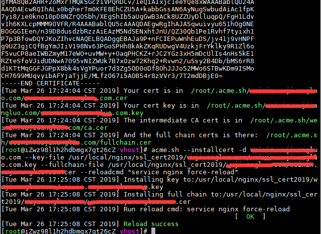

简单来说acme.sh 实现了 acme 协议, 可以从 let‘s encrypt 生成免费的证书。
acme.sh 有以下特点：
一个纯粹用Shell（Unix shell）语言编写的ACME协议客户端。
完整的ACME协议实施。 支持ACME v1和ACME v2 支持ACME v2通配符证书
简单，功能强大且易于使用。你只需要3分钟就可以学习它。
Let's Encrypt免费证书客户端最简单的shell脚本。
纯粹用Shell编写，不依赖于python或官方的Let's Encrypt客户端。
只需一个脚本即可自动颁发，续订和安装证书。 不需要root/sudoer访问权限。
支持在Docker内使用，支持IPv6

<!-- more -->

**安装环境：**
**操作系统：centos 7 X64**
**SSL证书来源：Let's Encrypt**
**安装用脚本：acme.sh**
**服务器：nginx**
**域名：epoint.pswen.cn**

1.安装acme.sh

```shell
curl https://get.acme.sh | sh
```

2.安装后的配置
把 acme.sh 安装到你的 home 目录下:~/.acme.sh/并创建 一个 bash 的 alias, 方便你的使用:

```shell
alias acme.sh=~/.acme.sh/acme.sh
echo 'alias acme.sh=~/.acme.sh/acme.sh' >>/etc/profile
```

3.申请证书
acme.sh 实现了 acme 协议支持的所有验证协议. 一般有两种方式验证: http 和 dns 验证（本文不提供dns方式申请，dns手动模式，不能自动更新证书。在续订证书时，您必须手动向域中添加新的txt记录。）

HTTP 方式方法如下：

```sh
acme.sh --issue -d epoint.pswen.cn --webroot /nginx网站根目录
```

只需要指定域名, 并指定域名所在的网站根目录【命令中根目录路径】. acme.sh 会全自动的生成验证文件, 并放到网站的根目录, 然后自动完成验证. 最后会聪明的删除验证文件. 整个过程没有任何副作用.

4.证书的安装
注意, 默认生成的证书都放在安装目录下: ~/.acme.sh/, 请不要直接使用此目录下的文件,
例如: 不要直接让 nginx/apache 的配置文件使用这下面的文件.
这里面的文件都是内部使用, 而且目录结构可能会变化.

正确的使用方法是使用 --installcert 命令,并指定目标位置, 然后证书文件会被copy到相应的位置,

Nginx服务：`service nginx force-reload`。(centos6)

Nginx服务：`systemctl restart nginx `。(centos7)

nginx示例1:

```shell
acme.sh --installcert -d epoint.pswen.cn --key-file /usr/local/nginx/ssl_cert/epoint.pswen.cn.key --fullchain-file /usr/local/nginx/ssl_cert/epoint.pswen.cn.cer --reloadcmd "service nginx force-reload"
```

nginx示例2：

```sh
acme.sh --install-cert -d chandao.test.com \
--key-file /usr/local/nginx/ssl_cert/test.com/chandao.test.com.key \
--fullchain-file /usr/local/nginx/ssl_cert/test.com/chandao.test.com.cer \
--reloadcmd      "service nginx force-reload"
```

附带完成前面1-4步骤的截图：



5. Nginx服务器安装SSL证书

Nginx 配置Http和Https共存

```shell
listen 80; #如果硬性要求全部走https协议，这一行去除
listen 443 ssl http2; #如果硬性要求全部走https协议，这里去除ssl
server_name chandao.test.com;

#ssl on; #如果硬性要求全部走https协议，这里开启ssl on
ssl_certificate /usr/local/nginx/ssl_cert/test.com/chandao.test.com.cer;
ssl_certificate_key /usr/local/nginx/ssl_cert/test.com/chandao.test.com.key;

#ssl性能调优
#nginx 1.13.0支持了TLSv1.3,TLSv1.3相比之前的TLSv1.2、TLSv1.1等性能大幅提升
ssl_protocols TLSv1 TLSv1.1 TLSv1.2;
ssl_ciphers EECDH+CHACHA20:EECDH+AES128:RSA+AES128:EECDH+AES256:RSA+AES256:EECDH+3DES:RSA+3DES:!MD5;
ssl_prefer_server_ciphers on;
ssl_session_timeout 10m;
#使用ssl_session_cache优化https下Nginx的性能
ssl_session_cache builtin:1000 shared:SSL:10m;
#OCSP Stapling 开启。OCSP是用于在线查询证书吊销情况的服务，使用OCSP Stapling能将证书有效状态的信息缓存到服务器，提高 TLS 握手速度
ssl_stapling on;
#OCSP Stapling 验证开启
ssl_stapling_verify on; 
```

完整例子：

```shell
server {
  listen 80;  #如果硬性要求全部走https协议，这一行去除
  listen       443 ssl http2;    #如果硬性要求全部走https协议，这里去除ssl
  server_name chandao.test.com;
  access_log off;
  index index.html index.htm index.php;
  root /data/wwwroot/chandao;

  #ssl on;   #如果硬性要求全部走https协议，这里开启ssl on
  ssl_certificate   /usr/local/nginx/ssl_cert/test.com/chandao.test.com.cer;
  ssl_certificate_key  /usr/local/nginx/ssl_cert/test.com/chandao.test.com.key;

  #ssl性能调优
  #nginx 1.13.0支持了TLSv1.3,TLSv1.3相比之前的TLSv1.2、TLSv1.1等性能大幅提升
  ssl_protocols TLSv1 TLSv1.1 TLSv1.2;
  ssl_ciphers EECDH+CHACHA20:EECDH+AES128:RSA+AES128:EECDH+AES256:RSA+AES256:EECDH+3DES:RSA+3DES:!MD5;
  ssl_prefer_server_ciphers on;
  ssl_session_timeout 10m;
  #使用ssl_session_cache优化https下Nginx的性能
  ssl_session_cache builtin:1000 shared:SSL:10m;
  #OCSP Stapling 开启。OCSP是用于在线查询证书吊销情况的服务，使用OCSP Stapling能将证书有效状态的信息缓存到服务器，提高 TLS 握手速度
  ssl_stapling on;
  #OCSP Stapling 验证开启
  ssl_stapling_verify on; 

  #error_page 404 /404.html;
  #error_page 502 /502.html;

  location ~ [^/]\.php(/|$) {
    #fastcgi_pass remote_php_ip:9000;
    fastcgi_pass unix:/dev/shm/php-cgi.sock;
    fastcgi_index index.php;
    include fastcgi.conf;
  }

  location ~ .*\.(gif|jpg|jpeg|png|bmp|swf|flv|mp4|ico)$ {
    expires 30d;
    access_log off;
  }
  location ~ .*\.(js|css)?$ {
    expires 7d;
    access_log off;
  }
  location ~ /\.ht {
    deny all;
  }
}
```

6.重启nginx
保存退出后，通过nginx -t来检查配置文件是否正确，有错误的话改之即可。配置文件检测正确之后，通过service nginx force-reload来重载配置文件。

```shell
nginx -t
systemctl restart nginx
```
