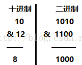
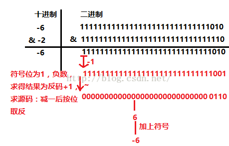

日常开发中位运算不是很常用，但是巧妙的使用位运算可以大量减少运行开销，优化算法。举个例子，翻转操作比较常见，比如初始值为1，操作一次变为0，再操作一次变为1。可能的做法是使用三木运算符，判断原始值为1还是0，如果是1，设置为0，否则设置为0.但是使用位运算，不用判断原始值，直接改变值就可以：`1^num `,num为原始值。当然，一条语句可能对代码没什么影响，但是在高重复，大数据量的情况下将会节省很多开销。

<!-- more -->

# 1. 位运算符

## 1.1 java支持的位运算符：

&：按位与。

|：按位或。

~：按位非。

^：按位异或。

<<：左位移运算符。

\>>：右位移运算符。

<<<：无符号右移运算符。

位运 算 符 中 ,除 ～ 以 外 ,其余 均 为 二 元 运 算 符 。 操 作 数 只 能 为 整 型 和字 符 型 数 据 。

Java使用 补 码 来 表 示 二 进 制 数 ,在补 码 表 示 中 ,最高 位 为 符号 位 ,正数 的 符 号 位 为 0,负数 为 1。补 码 的 规 定 如 下 :

对 正 数 来 说 ,最高位为 0,其余 各 位 代 表 数 值 本 身 (以二 进制 表 示 ),如 +42的补码 为 00101010。

对 负 数 而 言 ,把该 数 绝 对 值 的 补 码 按 位 取 反 ,然后 对 整 个数 加 1,即得 该 数的 补 码 。 如 -1的补 码 为11111111111111111111111111111111(00000000000000000000000000000001按 位 取 反 11111111111111111111111111111110+1=11111111111111111111111111111111 )。为何有那么多0、1，java中int是32位的。

## 1.2  按位与（&）

按位与的运算规则

| 操作数1 | 0    | 0    | 1    | 1    |
| ------- | ---- | ---- | ---- | ---- |
| 操作数2 | 0    | 1    | 0    | 1    |
| 按位与  | 0    | 0    | 0    | 1    |

规则总结：只有两个操作数对应位同为1时，结果为1，其余全为0. （或者是只要有一个操作数为0，结果就为0）。

举例：



 



 


 

## 1.3 按位或（|）

按位或的运算规则

| 操作数1 | 0    | 0    | 1    | 1    |
| ------- | ---- | ---- | ---- | ---- |
| 操作数2 | 0    | 1    | 0    | 1    |
| 按位或  | 0    | 1    | 1    | 1    |

规则总结：只有两个操作数对应位同为0时，结果为0，其余全为1.（或者是只要有一个操作数为1，结果就为1）。

## 1.4按位非（~）

按位非的运算规则

| 操作数 | 0    | 1    |
| ------ | ---- | ---- |
| 按位或 | 1    | 0    |

在求负数的源码中使用过。

## 1.5 按位异或（^）

按位异或的运算规则

| 操作数1  | 0    | 0    | 1    | 1    |
| -------- | ---- | ---- | ---- | ---- |
| 操作数2  | 0    | 1    | 0    | 1    |
| 按位异或 | 0    | 1    | 1    | 0    |

规则总结：异：1.

## 1.6 左位移（<<）

算术右移（>>）: 符号位不变，低位补0。如：2<<2结果为8。


当移动的位数超过数字本身的位数时，那么不就都需要补0操作，实际上不是的，java不可能做那么浪费资源的事情。在真正执行位移前，其对要移动的位数做了一些预处理，比如32处理为0，-1处理为31.

## 1.7 右位移（>>）

低位溢出，符号位不变，并用符号位补溢出的高位。如：-6>>2结果为-2。


 

## 1.8 无符号右移（>>>）

低位溢出，高位补0。注意，无符号右移（>>>）中的符号位（最高位）也跟着变，无符号的意思是将符号位当作数字位看待。如：-1>>>1结果为2147483647。这个数字应该比较熟悉，看两个输出语句就知道是什么了：

`System.out.println(Integer.toBinaryString(-1>>>1));`

`System.out.println(Integer.toBinaryString(Integer.MAX_VALUE));`

输出结果为：

1111111111111111111111111111111

1111111111111111111111111111111

-1>>>1竟然得到了int所能表示的最大整数，精彩。


除了使用-1>>>1能得到Integer.MAX_VALUE，以下的也能得到同样的结果：

​    //maxInt

​    System.*out*.println(~(1 << 31));

​    System.*out*.println((1 << -1)-1);

​    System.*out*.println(~(1 << -1));

使用位运算往往能很巧妙的实现某些算法完成一些复杂的功能。

# 常见使用

## 1.   m*2^n

可以使用m<<n求得结果，如：

​    System.*out*.println("2^3=" + (1<<3));//2^3=8

​    System.*out*.println("3*2^3=" + (3<<3));//3*2^3=24

计算结果是不是很正确呢？如果非要说2<<-1为什么不等于0.5，前面说过，位运算的操作数只能是整型和字符型。在求int所能表示的最小值时，可以使用

//minInt

System.*out*.println(1 << 31);

System.*out*.println(1 << -1);

可以发现左移31位和-1位所得的结果是一样的，同理，左移30位和左移-2所得的结果也是一样的。移动一个负数位，是不是等同于右移该负数的绝对值位呢？输出一下就能发现不是的。java中int所能表示的最大数值是31位，加上符号位共32位。在这里可以有这样的位移法则：

法则一：任何数左移（右移）32的倍数位等于该数本身。

法则二：在位移运算m<<n的计算中，若n为正数，则实际移动的位数为n%32，若n为负数，则实际移动的位数为(32+n%32)，右移，同理。

左移是乘以2的幂，对应着右移则是除以2的幂。

## 2.   判断一个数n的奇偶性

n&1 == 1?”奇数”:”偶数”

为什么与1能判断奇偶？所谓的二进制就是满2进1，那么好了，偶数的最低位肯定是0（恰好满2，对不对？），同理，奇数的最低位肯定是1.int类型的1，前31位都是0，无论是1&0还是0&0结果都是0，那么有区别的就是1的最低位上的1了，若n的二进制最低位是1（奇数）与上1，结果为1，反则结果为0.

## 3.   不用临时变量交换两个数

在int[]数组首尾互换中，是不看到过这样的代码：

 

```
 
```

1. `public static int[] reverse(int[] nums){`
2. `int i = 0;`
3. `int j = nums.length-1;`
4. `while(j>i){`
5. `nums[i]= nums[i]^nums[j];`
6. `nums[j] = nums[j]^nums[i];`
7. `nums[i] = nums[i]^nums[j];`
8. `j--;`
9. `i++;`
10. `}`
11. `return nums;`
12. `}`

连续三次使用异或，并没有临时变量就完成了两个数字交换，怎么实现的呢？

 


上面的计算主要遵循了一个计算公式：b^(a^b)=a。

我们可以对以上公式做如下的推导：

任何数异或本身结果为0.且有定理a^b=b^a。异或是一个无顺序的运算符，则b^a^b=b^b^a，结果为0^a。

再次列出异或的计算表:

| 操作数1  | 0    | 0    | 1    | 1    |
| -------- | ---- | ---- | ---- | ---- |
| 操作数2  | 0    | 1    | 0    | 1    |
| 按位异或 | 0    | 1    | 1    | 0    |

可以发现，异或0具有保持的特点，而异或1具有翻转的特点。使用这些特点可以进行取数的操作。

​     那么0^a，使用异或0具有保持的特点，最终结果就是a。

其实java中的异或运算法则完全遵守数学中的计算法则：

①  a ^ a =0

②  a ^ b =b ^ a

③  a ^b ^ c = a ^ (b ^ c) = (a ^ b) ^ c;

④  d = a ^b ^ c 可以推出 a = d ^ b ^ c.

⑤  a ^ b ^a = b.

## 4.   取绝对值

(a^(a>>31))-(a>>31)

先整理一下使用位运算取绝对值的思路：若a为正数，则不变，需要用异或0保持的特点；若a为负数，则其补码为源码翻转每一位后+1，先求其源码，补码-1后再翻转每一位，此时需要使用异或1具有翻转的特点。

任何正数右移31后只剩符号位0，最终结果为0，任何负数右移31后也只剩符号位1，溢出的31位截断，空出的31位补符号位1，最终结果为-1.右移31操作可以取得任何整数的符号位。

那么综合上面的步骤，可得到公式。a>>31取得a的符号，若a为正数，a>>31等于0，a^0=a，不变；若a为负数,a>>31等于-1 ，a^-1翻转每一位.