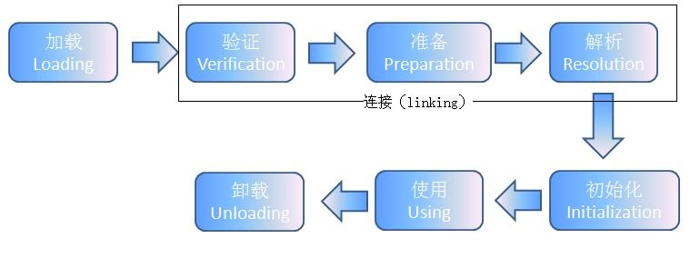

在 Java 语言里面，类型的加载、连接和初始化过程都是在程序运行期间完成的，这种策略虽然会令类加载时稍微增加一些性能开销，但是会为 Java 应用程序提供高度的灵活性，Java 里天生可以动态扩展的语言特性就是依赖于运行期动态加载和动态连接这个特点实现的。

<!-- more -->

例如，如果编写一个面向接口的应用程序，可以等到运行时再指定其实际的实现类；用户可以通过 Java 预定义的和自定义类加载器，让一个本地的应用程序可以在运行时从网络或其他地方加载一个二进制流作为程序代码的一部分，这种组装应用程序的方式目前已广泛应用于 Java 程序之中。从最基础的 Applet、JSP 到相对复杂的 OSGI 技术，都使用了 Java 语言运行期类加载的特性。

## 类加载机制

生命周期：加载（Loading）、验证（Verification）、准备（Preparation）、解析（Resolution）、初始化（Initialzation）、使用（Using）和卸载（Unloading）7 个阶段。

什么情况下需要开始进行类加载过程的第一阶段呢？没有明确约束，虚拟机自由把握；

而初始化阶段有严格规范，以下五种情况必须理解对类进行初始化。

1. 遇到new（new关键词实例化），getstatic（读取类的static字段），putstatic（设置类的static字段，被final修饰、已在编译期就把结果放入了常量池的字段除外），invokestatic（调用一个类的静态方法）
2. 使用`java.lang.reflect`包的方法对类进行反射调用
3. 初始化一个类，会先初始化它的父类
4. 虚拟机启动时，会先初始化执行的主类（main方法）
5. JDK1.7的`java.lang.invoke.MethodHandle`的方法去获取句柄

***有且仅有***这五种情况，除此之外都是被动引用，不会触发初始化，举3个例子

- 对于静态字段，只有定义这个字段的类才会被初始化，例如父类定义的静态字段，通过子类去使用父类的静态字段，那么只有父类会初始化，子类不会
- 数组类型定义使用时，类似`SubClass[]`不会进行初始化
- 被finla修饰的静态字段，会进行常量传播优化，实际上这个字段已经和这个类没啥关系了

初始化第三种情况下，对于接口有个特例情况：一个类初始化时要求父类全部初始化，而接口，不要求其父接口全部都完成初始化，只有在使用到才会初始化。

