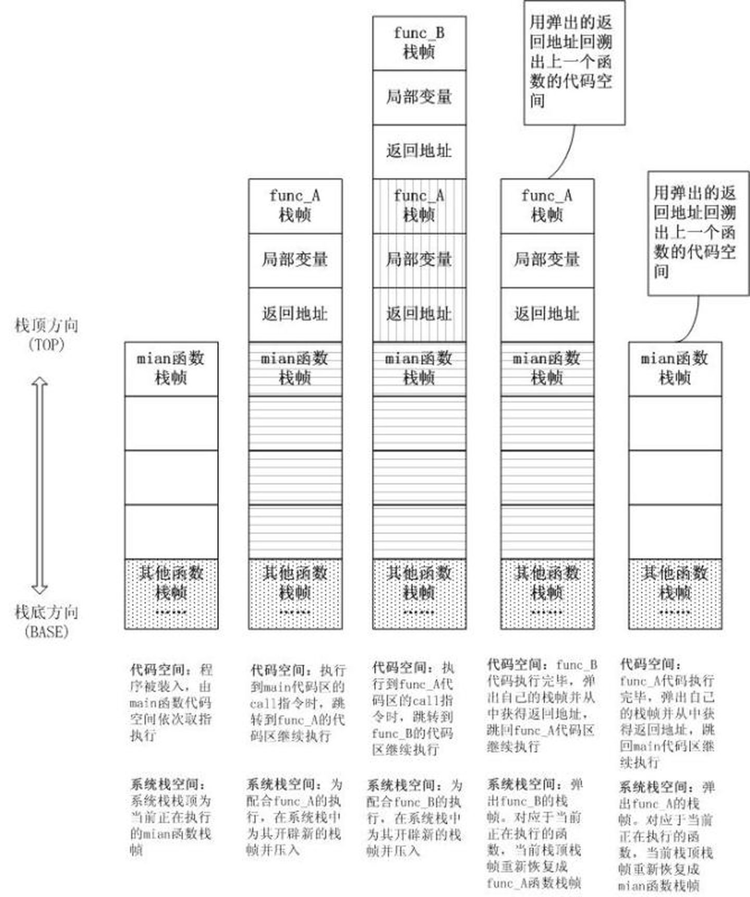

JVM的`-X`参数是非标准参数，在不同版本的JVM中，参数可能会有所不同，可以通过`java -X`查看非标准参数

```plaintext
> java -X

    -Xbatch           禁用后台编译
    -Xbootclasspath/a:<以 : 分隔的目录和 zip/jar 文件>
                      附加在引导类路径末尾
    -Xcheck:jni       对 JNI 函数执行其他检查
    -Xcomp            强制在首次调用时编译方法
    -Xdebug           不执行任何操作。为实现向后兼容而提供。
    -Xdiag            显示附加诊断消息
    -Xfuture          启用最严格的检查，预期将来的默认值。
                      此选项已过时，可能会在
                      未来发行版中删除。
    -Xint             仅解释模式执行
    -Xinternalversion
                      显示比 -version 选项更详细的
                      JVM 版本信息
    -Xlog:<opts>      配置或启用采用 Java 虚拟
                      机 (Java Virtual Machine, JVM) 统一记录框架进行事件记录。使用 -Xlog:help
                      可了解详细信息。
    -Xloggc:<file>    将 GC 状态记录在文件中（带时间戳）。
                      此选项已过时，可能会在
                      将来的发行版中删除。它将替换为 -Xlog:gc:<file>。
    -Xmixed           混合模式执行（默认值）
    -Xmn<size>        为年轻代（新生代）设置初始和最大堆大小
                      （以字节为单位）
    -Xms<size>        设置初始 Java 堆大小
    -Xmx<size>        设置最大 Java 堆大小
    -Xnoclassgc       禁用类垃圾收集
    -Xrs              减少 Java/VM 对操作系统信号的使用（请参见文档）
    -Xshare:auto      在可能的情况下使用共享类数据（默认值）
    -Xshare:off       不尝试使用共享类数据
    -Xshare:on        要求使用共享类数据，否则将失败。
                      这是一个测试选项，可能导致间歇性
                      故障。不应在生产环境中使用它。
    -XshowSettings    显示所有设置并继续
    -XshowSettings:all
                      显示所有设置并继续
    -XshowSettings:locale
                      显示所有与区域设置相关的设置并继续
    -XshowSettings:properties
                      显示所有属性设置并继续
    -XshowSettings:vm
                      显示所有与 vm 相关的设置并继续
    -XshowSettings:system
                      （仅 Linux）显示主机系统或容器
                      配置并继续
    -Xss<size>        设置 Java 线程堆栈大小
    -Xverify          设置字节码验证器的模式
                      请注意，选项 -Xverify:none 已过时，
                      可能会在未来发行版中删除。
    --add-reads <module>=<target-module>(,<target-module>)*
                      更新 <module> 以读取 <target-module>，而无论
                      模块如何声明。
                      <target-module> 可以是 ALL-UNNAMED，将读取所有未命名
                      模块。
    --add-exports <module>/<package>=<target-module>(,<target-module>)*
                      更新 <module> 以将 <package> 导出到 <target-module>，
                      而无论模块如何声明。
                      <target-module> 可以是 ALL-UNNAMED，将导出到所有
                      未命名模块。
    --add-opens <module>/<package>=<target-module>(,<target-module>)*
                      更新 <module> 以在 <target-module> 中打开
                      <package>，而无论模块如何声明。
    --illegal-access=<value>
                      允许或拒绝通过未命名模块中的代码对命名模块中的
                      类型成员进行访问。
                      <value> 为 "deny"、"permit"、"warn" 或 "debug" 之一
                      此选项将在未来发行版中删除。
    --limit-modules <module name>[,<module name>...]
                      限制可观察模块的领域
    --patch-module <module>=<file>(:<file>)*
                      使用 JAR 文件或目录中的类和资源
                      覆盖或增强模块。
    --source <version>
                      设置源文件模式中源的版本。

这些额外选项如有更改, 恕不另行通知。


以下选项是特定于 macOS 的选项：
    -XstartOnFirstThread
                      在第一个 (AppKit) 线程上运行 main() 方法
    -Xdock:name=<application name>
                      覆盖停靠栏中显示的默认应用程序名称
    -Xdock:icon=<path to icon file>
                     覆盖停靠栏中显示的默认图标
```

## -Xint、-Xcomp与-Xmixed参数

### -Xint参数

```plaintext
在解释模式（interpreted mode）下，-Xint标记会强制JVM执行所有的字节码，这当然会降低运行速度，通常低10倍或更多。
```


### -Xcomp参数

```plaintext
-Xcomp参数与-Xint正好相反，JVM在第一次使用时会把所有的字节码编译成本地代码，从而带来最大程度的优化。
```


然而，很多应用在使用-Xcomp也会有一些性能损失，当然这笔-Xint损失的少，原因是-Xcomp没有让JVM启用JIT编译器的全部功能。JIT编译器可以对是否需要编译做出判断。如果所有代码都需要进行编译的话，对于一些只执行一次的代码就没有意义了。

### -Xmixed参数

```plaintext
-Xmixed是混合模式，将解释模式和变异模式进行混合使用，有JVM自己决定，这是JVM的默认模式，也是推荐模式
```


## JVM方法内联优化

###  前言

在日常中工作中，我们时不时会代码进行一些优化，比如用新的算法，简化计算逻辑，减少计算量等。对于java程序来说，除了开发者本身对代码优化之外，还有一个"人"也在背后默默的优化我们的代码，这个"人"就是jvm。jvm会帮我们分析出热点代码，优化代码逻辑。其中jvm最常做的优化之一就是：方法内联优化。

### 方法内联

什么是方法内联？又可以叫做函数内联，java中方法可等同于其它语言中的函数。关于方法内联维基百科上面解释是：

> 在计算机科学中，内联函数（有时称作在线函数或编译时期展开函数）是一种编程语言结构，用来建议编译器对一些特殊函数进行内联扩展（有时称作在线扩展）；也就是说**建议编译器将指定的函数体插入并取代每一处调用该函数的地方（上下文），从而节省了每次调用函数带来的额外时间开支。**

简单通俗的讲就是把方法内部调用的其它方法的逻辑，嵌入到自身的方法中去，变成自身的一部分，之后不再调用该方法，从而节省调用函数带来的额外开支。

### 函数调用开销

之所以出现方法内联是因为函数调用除了执行自身逻辑的开销外，还有一些不为人知的额外开销。这部分额外的开销主要来自方法栈帧的生成、参数字段的压入、栈帧的弹出、还有指令执行地址的跳转。比如有下面这样代码：

```java
public static void function_A(int a, int b){
    //do something
    function_B(a,b);
}

public static void function_B(int c, int d){
    //do something
}

public static void main(String[] args){
     function_A(1,2);
}
```

则代码的执行过程如下：



 

所以如果java中方法调用嵌套过多或者方法过多，这种额外的开销就越多。

试想一下想get/set这种方法调用：

```java
public int getI() {
    return i;
}

public void setI(int i) {
    this.i = i;
} 
```

很可能自身执行逻辑的开销还比不上为了调用这个方法的额外开锁。如果类似的方法被频繁的调用，则真正相对执行效率就会很低，虽然这类方法的执行时间很短。这也是为什么jvm会在热点代码中执行方法内联的原因，这样的话就可以省去调用调用函数带来的额外开支。

这里举个内联的可能形式：

```java
public int  add(int a, int b , int c, int d){
      return add(a, b) + add(c, d);
}

public int add(int a, int b){
    return a + b;
}
```

内联之后：

```java
public int  add(int a, int b , int c, int d){
      return a + b + c + d;
}
```

这样除了本身的相加逻辑的开销，比内联前减少了二次调用函数带来的额外开销。 

### 内联条件

一个方法如果满足以下条件就很可能被jvm内联。

1、热点代码： 如果一个方法的执行频率很高就表示优化的潜在价值就越大。那代码执行多少次才能确定为热点代码？这是根据编译器的编译模式来决定的。如果是客户端编译模式则次数是1500，服务端编译模式是10000。次数的大小可以通过-XX:CompileThreshold来调整。

2、方法体不能太大：jvm中被内联的方法会编译成机器码放在code cache中。如果方法体太大，则能缓存热点方法就少，反而会影响性能。

3、如果希望方法被内联，尽量用private、static、final修饰，这样jvm可以直接内联。如果是public、protected修饰方法jvm则需要进行类型判断，因为这些方法可以被子类继承和覆盖，jvm需要判断内联究竟内联是父类还是其中某个子类的方法。

>  所以了解jvm方法内联机制之后，会有助于我们工作中写出能让jvm更容易优化的代码，有助于提升程序的性能。
